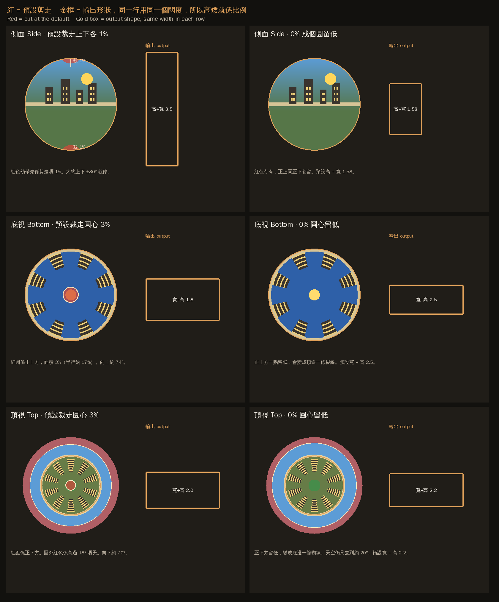

# unwrap-fisheye-image

Unwrap a circular fisheye, an upward fisheye, or a tiny-planet photo into a normal panoramic JPEG, entirely in the browser.

在瀏覽器入面，把圓形魚眼、望天魚眼或小行星圖展開成普通全景 JPEG。

- 中文 / Chinese: <https://rayony.github.io/unwrap-fisheye-image/>
- English: <https://rayony.github.io/unwrap-fisheye-image/en.html>

## How to use

1. Open either page above.
2. Drop or choose a JPEG or PNG.
3. Pick a view:
   - **Side (looking forward):** the centre is ahead. Crop the top and bottom of the circle. At 0% the whole circle is kept, then set height ÷ width.
   - **Bottom (looking up):** the centre is straight up. Crop the centre and set where the circle starts.
   - **Top (tiny planet / looking down):** the centre is straight down. Crop the planet centre and set the start angle.
4. Tick **Flip left–right** if the result is mirrored.
5. Click **Save JPEG**.

**Convert automatically after upload** is on by default. Turn it off to convert only when you click **Convert**.

## 點用

1. 打開上面任一頁。
2. 拖入或選擇一張 JPEG／PNG。
3. 揀視角：
   - **側面（望前）**：圓心係前方。可調上下裁切；0% 會保留成個圓，再揀高÷寬。
   - **底視（望天）**：圓心係正上方。可調圓心裁切同圓周起點。
   - **頂視（小行星／望下）**：圓心係正下方。可調行星圓心裁切同圓周起點。
4. 需要時剔「左右反轉」。
5. 撳「儲存 JPEG」。

「上傳後自動展開」預設開住。取消之後，要自己撳「展開」先轉換。

## Privacy / 私隱

No image is uploaded to any server. Processing stays on your device, in the browser, using plain JavaScript only. No third-party library is used.

圖片唔會上傳到任何伺服器。所有處理都留喺你部裝置嘅瀏覽器入面，只用純 JavaScript，冇用任何外加程式庫。

## Files / 檔案

- `index.html` — Chinese page. One file, works offline.
- `en.html` — English page. Same tool.
- `sample-fisheye.png` — diagram of the three views and the two crop settings.
- 示範圖係 `sample-fisheye.png`。

## How it works / 點樣拆

Imagine the round photo as a round window that squashed the view into a circle. The page spreads it back into a rectangle.

圓相好似一扇圓窗，把景色壓入一個圓。呢頁把個圓攤返做長方形。

In each row the gold boxes share one width, so height shows the ratio. Side default crop 1% makes a picture about 3.5 times as tall as it is wide. At 0% the default height ÷ width is 1.58. Bottom default crop 3% makes a picture about 1.8 times as wide as it is tall. At 0% the default width ÷ height is 2.5. Top default crop 3% makes a picture about twice as wide as it is tall. At 0% the default width ÷ height is 2.2.

每一行金框用同一個闊度，高矮就係比例。側面預設裁 1%，高大約係闊嘅 3.5 倍；0% 預設高÷寬 1.58。底視預設裁圓心 3%，寬大約係高嘅 1.8 倍；0% 預設寬÷高 2.5。頂視預設裁圓心 3%，寬大約係高嘅 2 倍；0% 預設寬÷高 2.2。

### Side / 側面（望前）

The middle is looking straight ahead. Left and right are turning your head. Up and down are looking up or down.

圓心係望直前方。左右係轉頭，上下係望高望低。

### Bottom / 底視（望天）

The middle is the sky above you. The edge of the circle is the horizon. Going around the circle is turning your body all the way around, so the result is a long panorama.

圓心係頭頂嘅天。圓邊係地平線。沿住個圓行一圈，就係自己轉一個圈。

### Top / 頂視（小行星）

The middle is the ground under you. The round edge of the city is the horizon. The blue outside the circle is already sky.

圓心係腳下嘅地。城市圓邊係地平線。圓外面嘅藍色已經係天空。

### Crop more than 0% / 裁切大過 0%

We snip off the bit that would stretch the most, then unroll the rest like a poster on a tube. The further you look up or down, the taller that part must be drawn, so buildings look more natural. We stop before straight up or straight down, or the poster would be endlessly long.

Side view snips the top and bottom of the circle. Bottom view snips a small dot in the centre (the sky overhead). Top view snips a small dot in the planet centre (the ground under you), and leaves out sky more than 18° outside the circle.

剪走拉得最勁嗰截，再好似貼上圓筒咁攤平。愈望高或者愈望低，就要畫得愈高。唔去到正上或者正下，否則張紙會無限長。側面剪圓頂圓底。底視剪圓心一點天。頂視剪行星圓心一點地，圓外高過 18° 嘅天空都唔要。

### Crop at 0% / 裁切係 0%

The whole circle stays. The tube trick cannot include straight up or straight down, because that one direction would need an infinitely long poster. A gentler stretch is used instead: the middle still looks a bit like the tube, but it slows down near the edge so the whole circle fits. The slider chooses how tall or wide the poster is. The outer edge of the result is one point of the photo pulled into a line, so it looks smeared.

成個圓都留低。圓筒攤法去到正上或正下會要無限長嘅紙，所以改用溫和啲嘅拉法，去到邊就慢落嚟。滑桿揀張相幾高或者幾闊。最外嗰條邊其實只係一點被拉成一條線，所以會糊。

## License

MIT
